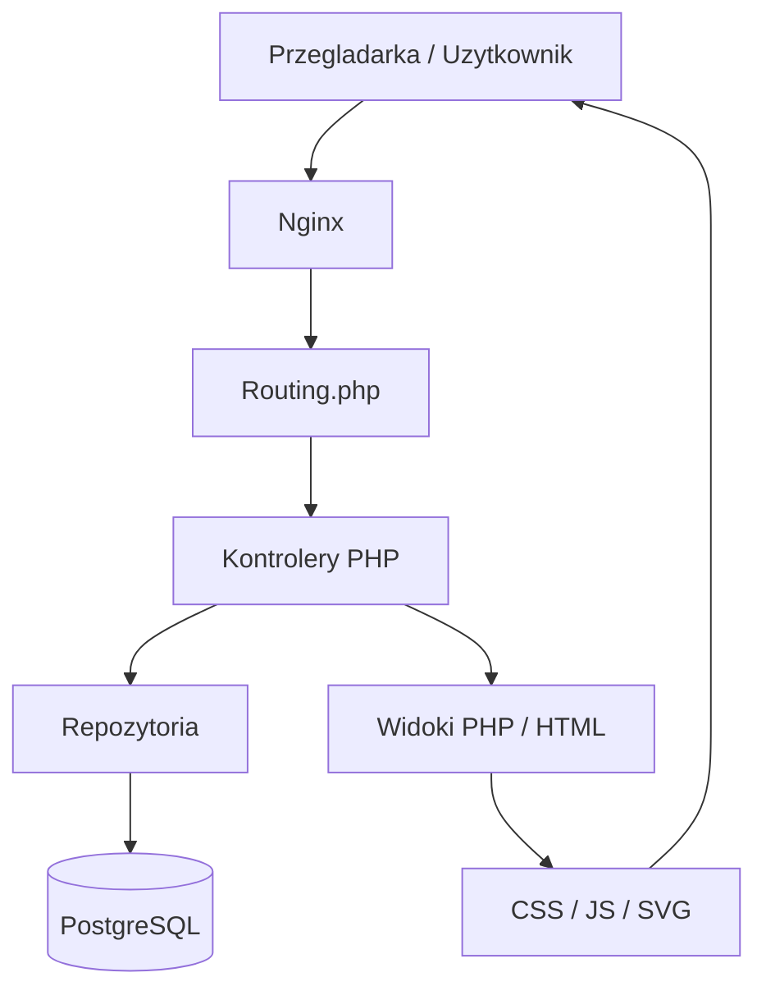

# Architektura

Warstwy:
- `Routing.php` mapuje trasy na kontrolery.
- `src/controllers` obsluguje logike HTTP, autoryzacje, walidacje i renderowanie widokow.
- `src/repositories` odpowiada za dostep do danych i zapytania SQL.
- `public/views` zawiera widoki i partiale.
- `public/scripts` i `public/styles` odpowiadaja za frontend i interakcje AJAX/FETCH.
- `docker/db/init/init.sql` zawiera czysty schemat bazy.
- `docker/db/seeds` zawiera dane startowe i seed demo.
